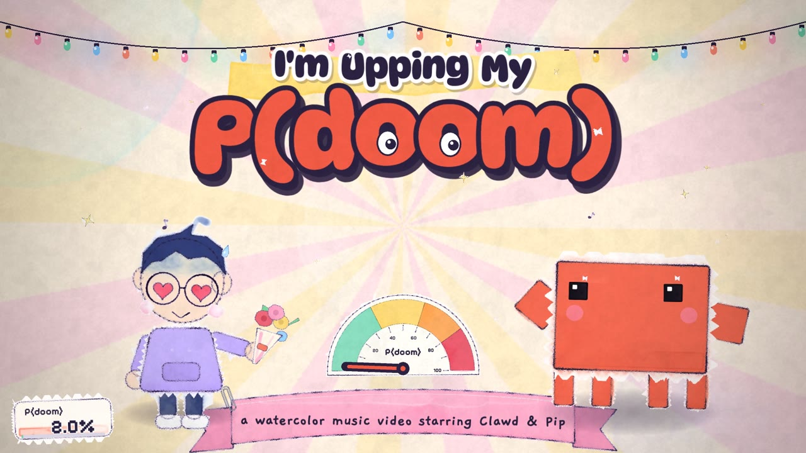
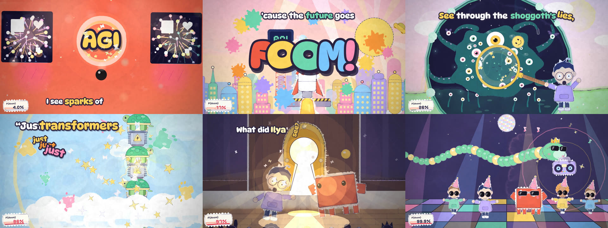

# I'm Upping My P(doom)

A 2:36 watercolor music video, animated in the browser with p5.js and p5.brush, synced word by word to the song.
It was made with two prompts to Claude Code.



**Watch it:** [the video on X](TODO-add-link-to-the-X-post)



## The two prompts

Everything in this repo came out of these two messages to Claude Code, running Claude Opus 5.5 at extra-high effort.
The whole build used about 10% of my weekly token limit.

The first prompt, with the song, the lyrics and a Clawd PNG attached:

```text
Here's the song audio and lyrics for "I'm Upping My P(doom)" @pdoom.mp3 @lyrics.txt

Make a full cutesy animation music video synced to this audio and lyrics. Use the Clawd character design as the AI character @clawd.png

Direction:
- cute, cartoony, fun colors, lively animation
- use p5 brushstrokes (p5.js + p5.brush watercolor look)
- make each scene visually interesting; something happening in every shot; be brave and ambitious
- interesting visuals and transitions for each lyric
- make every scene transition into the next

Don't invent a different song — stick to this audio + lyrics. You invent the scenes; I'm not specifying shot ideas
```

The second prompt, sent part-way through once the engine and the first scenes were working:

```text
Hey you can create a storyboard and animation guidelines, then use parallel opus 5.5 high subagents to handle each scene
```

That was it.
The rest of this README describes what Claude did between and after those two messages.

## How it was made

### 1. Listening to the song

Before drawing anything, Claude worked out exactly when every word is sung.

- [Whisper](https://github.com/openai/whisper) large-v3-turbo (via mlx-whisper) transcribed the song with word timestamps.
- The words were aligned against the supplied lyrics, so on-screen text always matches the real lyrics.
- Whisper tends to start a word as soon as the previous one ends, so onsets after instrumental gaps came out early. [Demucs](https://github.com/facebookresearch/demucs) split out the vocal track, and its energy was used to fix those onsets by hand (for example, one line moved from 35.5 s to 38.4 s).
- [librosa](https://librosa.org) found the tempo (129.2 BPM), all 332 beats, and energy envelopes that drive pulses and shakes.
- It also mapped the song's shape: the first chorus kick at 24.0 s, the breakdown at 88.8 s, the drop at 110.7 s, a near-silent gap at 138.3-139.9 s, and the loudest part of the song in the instrumental finale.

The scripts are in [`tools/audio/`](tools/audio), and the result is [`src/data.js`](src/data.js).

### 2. Building the engine

- **Painting once, animating forever.** p5.brush watercolor is too slow to repaint every frame, so about 600 sprites (characters, props, backgrounds) are painted once at load into WebGL framebuffers, then moved, squashed and layered every frame. Each sprite has up to three painted variants that swap 8 times a second, which gives the hand-drawn "boil".
- **Everything is a function of song time.** No frame depends on the one before it, so the video scrubs, seeks and exports frame-perfectly and stays locked to the audio.
- **Clawd** is rigged from the supplied pixel design's exact proportions (8x6 body, 2x2 arms, four 1x2 legs, square eyes), so he can walk, wave, hop and swap between a dozen eye expressions.
- **Pip**, the nervous human narrator (the "I" of the song), is an original character.
- **Transitions** run in a compositing shader with 12 types: watercolor bleed, cartoon iris, painted wipe, flash, zoom, paint drip, swirl, a Clawd-pixel mosaic, card flip, whip pan, and custom shaped masks.
- **The lyric layer** pops each word in at the moment it is sung, styled per line to fit each scene.
- **A P(doom) meter** in the corner climbs from 2% to 99.9% over the song, and every gauge in the video reads the same value.

### 3. The storyboard and the style guide

After the second prompt, Claude wrote two documents so that many animators could work in parallel and still make one film:

- [`docs/STORYBOARD.md`](docs/STORYBOARD.md) splits the song into 15 scenes, with word-timed story beats and a **handoff contract** for every boundary: what the outgoing scene ends on, and which transition the incoming scene uses (for example, the chat monster's open mouth becomes the iris that opens on the P(doom) gauge).
- [`docs/ANIMATION_GUIDE.md`](docs/ANIMATION_GUIDE.md) is the style bible and engine manual: the watercolor recipe, character rigs, motion principles (hit the words, ride the beat, anticipation and overshoot), lyric bands, performance budgets, and content rules.

### 4. Fifteen parallel animators

Claude then launched 15 Opus 5.5 subagents at once, one per scene.

- Each one owned exactly one file (`src/scenes/s01.js` to `s15.js`) and could not touch shared code.
- Each rendered its own frames headlessly with [`tools/frames.js`](tools/frames.js) and reviewed the contact sheets over several passes before reporting back.
- When agents hit bugs in the shared engine (a p5.brush quirk that dropped the last stroke of every sprite, a tint call that crashed the next frame, a paperclip that rendered as a grey blob), the lead session fixed them centrally and broadcast the fix to the agents still working.
- The agent definition is in [`.claude/agents/scene-animator.md`](.claude/agents/scene-animator.md).

### 5. Integration and export

- The lead session rendered frames straddling all 14 scene boundaries to check every handoff, then reviewed the whole video frame by frame for timing, readability and content.
- [`tools/export.js`](tools/export.js) renders all 4,700 frames in headless Chromium and pipes them into ffmpeg with the original audio, so the MP4 is frame-exact rather than a screen recording.

### By the numbers

| | |
|---|---|
| Song | 2:36, 45 lyric lines, 129.2 BPM |
| Scenes | 15 scenes, 55 shots |
| Painted sprites | about 600 |
| Code | 13,756 lines of scene code on a 1,215-line engine |
| Render time | about 8 ms per frame at 1920x1080 |
| Wall-clock time | about two hours from first prompt to finished MP4 |

## Run it

Open `index.html` in a browser, or serve the folder and open it:

```bash
npm run serve
```

It needs an internet connection for p5.js, p5.brush and the Google Fonts.
The title poster appears in a few seconds and the play button shows once every scene is painted.
Space plays and pauses, the arrow keys skip 5 seconds, L toggles the lyrics, and F toggles full screen.

## Render it yourself

You need Node.js, ffmpeg and a Chromium for Playwright:

```bash
npm install
```

```bash
npx playwright-core install chromium
```

Render the full MP4 (about the length of the song):

```bash
npm run export -- --out dist/pdoom.mp4
```

Render review frames and contact sheets for one scene:

```bash
npm run frames -- --out renders/s06 --scenes s06 --range 44.5 58.5 16
```

Bundle everything, audio included, into one self-contained HTML file:

```bash
npm run bundle
```

Set `CHROME_PATH` to use a different Chrome for the render tools.

## Re-run the audio analysis

The scripts in `tools/audio/` ran in this order: `transcribe.py`, `align.py`, `beats.py`, `separate.sh`, `vocal.py`, then `gendata.py`, which writes `src/data.js`.
They need Python with `mlx-whisper` (Apple Silicon), `librosa`, `soundfile` and `demucs`.
`gendata.py` holds the hand-checked onset fixes described above.

## Project layout

```text
index.html            player page (loads the engine and all 15 scenes)
src/data.js           word timings, beats and energy envelopes (generated)
src/core.js           math, timing, sprite system, text, transition shader
src/art.js            paint helpers, Clawd and Pip rigs, shared FX sprites
src/kit.js            shared effects and props (gauge, rocket, curtains, ...)
src/main.js           render pipeline, lyric layer, P(doom) HUD, player UI
src/scenes/s01-s15.js one file per scene
docs/                 storyboard and animation guide
tools/                frame renderer, MP4 exporter, bundler, audio analysis
```

## License and credits

- The code is released under the [MIT License](LICENSE).
- The song "I'm Upping My P(doom)", its lyrics and its audio (`pdoom.mp3`, `lyrics.txt` and the lyric text in `src/data.js`) are not covered by the MIT License. All rights reserved.
- Clawd, the AI character, comes from the supplied `clawd.png` design (the Claude Code mascot). The design is not covered by the MIT License.
- Built with [p5.js](https://p5js.org) (LGPL-2.1) and [p5.brush](https://github.com/acamposuribe/p5.brush) (MIT), with the DynaPuff, Gaegu and Pixelify Sans fonts from Google Fonts (SIL Open Font License).
